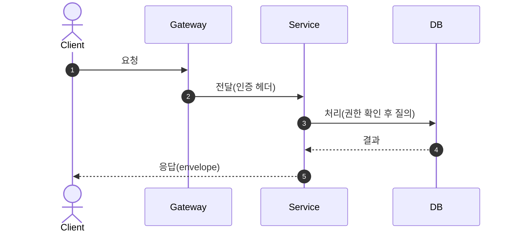

<!-- HARNESS STARTER KIT ({{PROJECT_NAME}}): {{FEATURE_NAME}}·{{SERVICE_NAME}}·{{PACKAGE_NS}} 치환 후 사용 -->

# Design — {{FEATURE_NAME}}

| 항목 | 값 |
|---|---|
| 상태 | draft \| in-review \| approved |
| SDD 단계 | design |
| 담당 모듈 | {{SERVICE_NAME}} <!-- 바운디드 컨텍스트를 적는다(예: order \| auth \| catalog). 모듈 표기는 스택 규약(`.agents/rules/structure.md`)을 따른다. --> |
| 연계 | ../requirements/{{FEATURE_NAME}}.md (req), ../tasks/active/{{FEATURE_NAME}}.md (tasks) |

> 가이드: design은 requirements를 "어떻게" 구현할지 확정한다. 구현자가 추측 없이
> 코딩할 수 있을 만큼 인터페이스·데이터·오류·테스트를 구체화한다.
> 선택한 방식과 **버린 대안의 이유**를 함께 적는다. 문체는 `.agents/rules/writing-style.md`.
> **선행 조건**: requirements에 미해결 `[NEEDS CLARIFICATION]`이 남아 있으면 설계를 시작하지 말고 `/hx-clarify`로 되돌린다.

## 1. Overview

- **요약**: (한두 문단)
- **설계 목표/비목표**: (무엇을 최적화하고 무엇은 안 하는가)
- **요구사항 매핑 요약**: (어떤 Req를 어떤 설계로 충족하는지 한 줄 요약)

## 2. Context & Constraints

<!-- [STACK 예시] 적용 규약·레이어는 프로젝트 아키텍처에 맞게 치환한다. -->
- 적용 규약: 규칙 원본 `.agents/rules/`(API 표준·보안·도메인 데이터 등), `ARCHITECTURE.md`
- 레이어: Types → Config → Repository → Service → Runtime → UI (단방향 의존)
- 제약/가정: (requirements에서 이어받은 것 + 설계상 제약)

## 3. Constitution Check *(게이트 · 필수)*

> **게이트**: 아래를 모두 통과해야 이후 설계를 확정한다. 위반이 불가피하면 아래 Complexity Tracking에
> 정당화를 남긴다(정당화 없으면 진행 금지). 헌법 = `.agents/rules/*` 원본
> (특히 guardrails·security·structure·api-standards·reliability) + `.agents/docs/decisions/core-beliefs.md`.

- [ ] **추측 금지·경계 파싱** (guardrails): 미확정을 지어내지 않고, 외부/미확정 값은 경계에서 검증하도록 설계했는가
- [ ] **보안 / 접근 제어** (security): 권한 판정 지점(요청 경계 + 유스케이스)·secret 원문 미반환·입력 검증을 설계에 반영했는가
- [ ] **레이어 단방향 의존** (structure): Types → Config → Repository → Service → Runtime → UI 역방향 의존이 없는가
- [ ] **API 표준** (api-standards): 공통 envelope·error code·버저닝을 따르는가
- [ ] **안정성** (reliability): 타임아웃·재시도·멱등성을 고려했는가
- [ ] (프로젝트별 추가 헌법 규칙 …)

### 3.1 Complexity Tracking *(위반 정당화 — 위반이 있을 때만)*

> 위 게이트 위반이 있으면 여기에 정당화한다(헥사고날 레이어 추가·추상화 도입 등). 위반이 없으면 "위반 없음".

| 위반 | 왜 필요한가 | 기각한 더 단순한 대안(이유) |
|---|---|---|
| (예: 레이어/추상화 추가) | (현재 이 기능에 필요한 이유) | (왜 기존 구조로 불충분한지) |

## 4. Architecture

### 4.1 컴포넌트 / 데이터 흐름

```mermaid
flowchart LR
  %% 컴포넌트/데이터 흐름. 클라이언트 → 앱 → 저장소(선택: 게이트웨이·프록시 경유)
```

- 흐름 설명: (요청 → 처리 → 저장/응답 경로)
- 동기/비동기 경계: (job·outbox·worker 사용 여부)

### 4.2 시퀀스 다이어그램 (핵심 플로우 — 필수)

> 주요 유스케이스(성공 경로 + 대표 실패/분기)를 sequenceDiagram으로 1개 이상 그린다.
> 인증/권한/트랜잭션 경계 같은 횡단 단계도 화살표로 드러낸다.



## 5. Components & Interfaces

> 컴포넌트별로 책임·공개 인터페이스(시그니처)·의존성을 명시한다.

### 5.1 <Component>

- **책임**: ...
- **인터페이스** (언어 시그니처/의사코드):
  <!-- 프로젝트 언어의 포트 표현으로 작성한다. JVM=interface, Python=Protocol/ABC, Go=interface. -->
  ```text
  XxxUseCase (inbound port)
    doSomething(input: InputDto) -> OutputDto        # 실패는 도메인 오류로 표현
  XxxRepository (outbound port)
    save(aggregate: Xxx) -> Xxx
    findByCode(code: XxxCode) -> Xxx | None
  ```
- **의존성**: (Repository, 외부 client 등)
- **에러**: (발생 가능한 도메인 오류 → error code)

## 6. API Design (해당 시)

> API 표준 준수. 엔드포인트별로 명시.

### `<METHOD> /api/v1/...`

- 인증: <!-- [STACK 예시] bearerAuth(JWT) \| apiKey \| webhookSignature -->
- 권한/scope: (role, scope)
- 요청:
  ```json
  { }
  ```
- 응답(성공, 공통 envelope):
  ```json
  { "data": { }, "meta": { "requestId": "", "timestamp": "" } }
  ```
- 오류: (error code → HTTP status 표)
- 멱등성/페이지네이션: (해당 시)

## 7. Data Models

> 도메인 데이터 규약/ERD와 일치. 테이블/엔티티별로.

### 테이블 `<name>`

| 컬럼 | 타입 | 제약 | 설명 |
|---|---|---|---|
| id | uuid | PK | |
| owner_id | uuid | FK, NOT NULL, index | 소유 주체(접근 판정 기준) |
| ... | | | |

- 인덱스: (WHERE/JOIN/ORDER BY 대상)
- 상태 전이: `A → B → C` (허용 전이만)

## 8. Error Handling

| 상황 | error code | HTTP | 처리 |
|---|---|---|---|
| (예) 리소스 미준비 | RESOURCE_NOT_READY | 409 | 재시도 안내 |

- 재시도/타임아웃/멱등성 정책 (RELIABILITY.md)

## 9. Security Design

- 인증/인가 흐름, 리소스 접근 권한을 판정하는 지점
- secret/key 처리(암호화·해시, 원문 미반환)
- 입력 검증(경계에서 parse), audit 대상 행위

## 10. Observability

- 로그(구조화, 민감정보 제외), 메트릭, audit 로그 기록 항목

## 11. Testing Strategy

- 단위 / 통합 / contract / E2E / 보안(권한 없는 접근 차단) / 실패 케이스
- 테스트 데이터·픽스처 전략

### 11.1 Quickstart (end-to-end 검증 시나리오 · 필수)

> 이 기능이 완성됐음을 사람이 직접 확인하는 최단 경로. tasks의 Polish 단계와 `/hx-analyze`가 이 시나리오를 참조한다.

- **선행**: (필요한 데이터·계정·환경 — 예: 시드 데이터, 인증된 테스트 계정)
- **실행**: (순서대로 밟을 명령/요청 — 예: `POST /api/v1/... ` → `GET /api/v1/...`)
- **기대 결과**: (관측 가능한 성공 신호 — 예: envelope `data` 반환, 상태 `A→B` 전이, audit 로그 1건)

## 12. Correctness Properties (PBT)

> 명세를 실행 가능한 불변식으로. property-based testing 대상.

- P1: <불변식> (예: "모든 결과 레코드는 caller의 소유 키를 가진다")
- P2: <불변식> (예: "동일 이벤트 재수신 시 부수효과는 1회만")

## 13. Migration / Rollout

- DB 마이그레이션 순서, 하위호환, 롤백 방법, 기능 플래그(해당 시)

## 14. Research & Decisions (ADR)

> 설계 조사(research) 로그. 설계 중 내린 결정과 근거, 기각한 대안을 남겨 재추론을 막는다.

### 14.1 결정 로그

| 결정 | 근거 | 기각한 대안 |
|---|---|---|
| (예: 상태 저장에 outbox 사용) | (일관성·재시도 요구) | (직접 호출 — 실패 시 유실) |

### 14.2 대안 비교 (해당 시)

| 대안 | 장점 | 단점 | 채택 여부 |
|---|---|---|---|

## 15. Open Questions

- [ ] (미해결 — 추측 금지. 남으면 `/hx-clarify`로 requirements를 먼저 갱신)

## 16. 요구사항 추적 매트릭스

| Requirement | 충족 설계 요소 |
|---|---|
| R1.1 | (컴포넌트/API/테이블/속성) |

## 17. 승인 체크리스트

- [ ] **Constitution Check**를 통과했는가(위반 시 §3.1 Complexity에 정당화 존재)
- [ ] 모든 Req(추적 ID `R#.#`)가 설계 요소로 추적되는가
- [ ] 인터페이스 시그니처가 구현 가능 수준인가
- [ ] 데이터 모델이 도메인 데이터 규약과 일치하는가
- [ ] 보안/접근 제어·오류·테스트 전략이 구체적인가
- [ ] Quickstart(end-to-end 검증 시나리오)가 정의되었는가
- [ ] 정확성 속성(PBT)이 정의되었는가
- [ ] 미해결 `[NEEDS CLARIFICATION]`이 없는가(있으면 `/hx-clarify`로 복귀)
